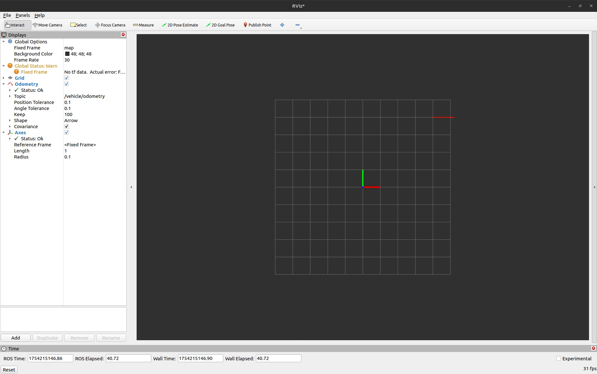

# odometry_pub_sub

## build
```bash
# install repo
git clone https://github.com/Kucukcollu/ros2_humble_notes.git

# move through ros2 workspace
cd ros2_humble_notes/colcon_ws

colcon build
```

## run
```bash
# source workspace
source install/setup.bash

# run publisher node
ros2 run odometry_pub_sub odometry_publisher

# run subscriber node
ros2 run odometry_pub_sub odometry_subscriber
```

## output
```bash
# you can view output in RViz2
rviz2
```

<p align="center">
  
</p>
